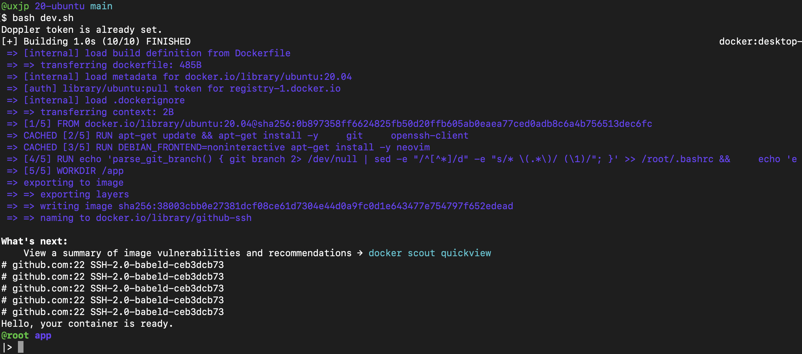

# Ubuntu GitHub SSH
Creates an image to be able to edit files with nvim and make contributions to your GitHub.  



Works plug and play with Ubuntu and MacOS.
This image just gets me a read to go enviroment with the minimum resorces I need to start coding within a Ubuntu container using an bash interactive section.  
To profit from this repo you should be apt to develop directly from the cli.  
It uses a doppler.com to store sensitive data necessary to access GitHub, removing the use of .env files to store environment variables.

## Run
```bash
./dev.sh
```
And feed your Doppler.com Access token. If your credentials and doppler secrets are configured as explained below your container will be read to pull and push from your github.

## Dependencies
- Doppler.com account
- Github SSH Key

## Credentials
I'm assuming you already have generated your SSH Keys, and that your Public Key is registered on your GitHub Account.

### GitHub SSH conection
- Create(if don't already have) a ssh key locally.
- Get hold of the values of the public and private keys(they probably be at ~/.ssh)
- Configure the key to be used as a new SSH Key in your GitHub account.
The connection will be automatically setup at container runtime using the `run.sh` script.

### Doppler.com
- Create a Doppler.com account (its free for the use case of this repo).
- Create a project.
- Set 4 Secrets for a `branch` like `dev`: ID_RSA_PUB_GITHUB, ID_RSA_GITHUB, GITHUB_EMAIL, GITHUB_NAME.

### Set up doppler in the Host Machine
Host machine relative to the docker container.
- Get a Doppler Service Token and Copy it
```
doppler.com login > project > [your project] > [branch] > access tab > generate new service token
```
- execute `auth-doppler.sh` and feed it your Doppler.com Service Token. Or just execute the `run.sh`

### Testing that Doppler is set up
```bash
doppler run -- bash -c 'echo "GITHUB_NAME: $GITHUB_NAME" && echo "GITHUB_EMAIL: $GITHUB_EMAIL"'
```

### Run your Dev Container
execute:  
```
dev.sh
```

## If the Container Stops
Most likely you accidentally stops the contianer just, start it and run a new intercative section with `exec`:  
```bash
docker start <container-id>
docker exec -it <container-id> bash
```

## Ubuntu container with Neovim
This repo is a improvemnet of the use case bellow. Run a Ubuntu container with Neovim properly installed:  
```bash
docker run -it ubuntu bash -c "apt-get update && DEBIAN_FRONTEND=noninteractive apt-get install -y neovim && bash"
```

