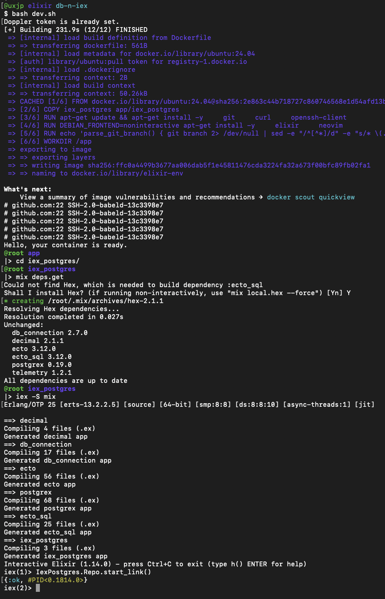
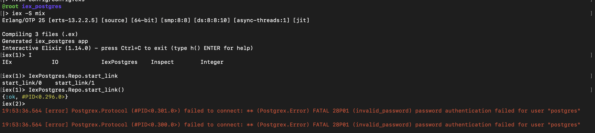

# IexPostgres

This repo aims to test database connections using iex with minimal code. This setup eliminates the need to install Elixir on the host machine or to install any databases locally, as all operations are executed within Docker containers.

## Testing 


### 1/6 Setup the Database

The Java repo contains scripts for this setup. Essentially, you'll need to create a new Docker network using the bridge driver and run a Postgres server container within that network.
The connection between the iex container and the Postgres container is achieved via the Docker network, so no ports need to be exposed for this example.

### 2/6 Test database conection

The Java repo provides a sample script to connect to the Postgres server container using a psql client container to test the credentials. The current repo using iex requires a few additional steps compared to the psql option.

### 3/6 Run the container
Run `dev.sh`

### 4/6 Get Deps
Run: 
```bash 
cd iex_container
mix deps.get
```

### 5/6 Get Deps
Inside the contianer run:  
```bash
iex -S mix
```

### 6/6 Test Connection to the Database
Inside the `iex` REPL type:  
```elixir
IexPostgres.Repo.start_link()
```

If the connection fails, you'll see an error message like this:


